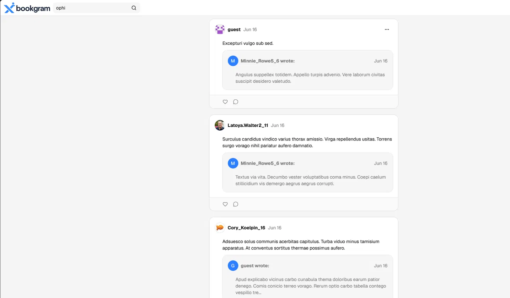
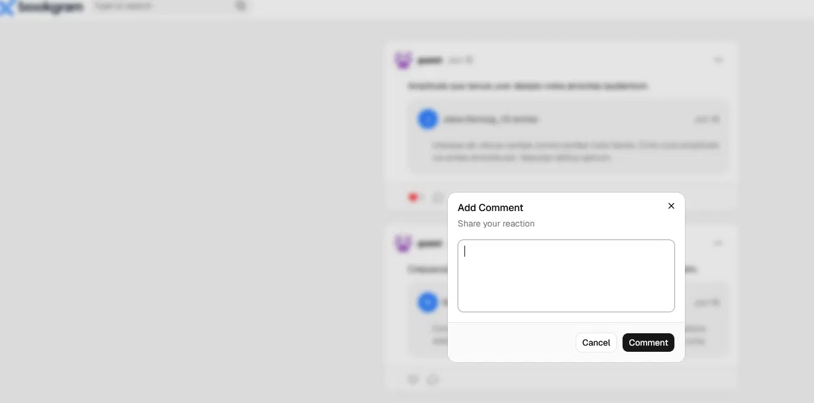

# Xbookgram

A full-stack social media web app built as a portfolio project. Users can post, comment, like, follow, share, and receive real-time notifications.

**Live demo:** https://xbookgram.up.railway.app/

> A guest login is available on the login page — no account needed.




---

## Features

- Google OAuth login + guest access
- Create, edit, delete, and share posts
- Comment and like on posts and comments
- Follow / unfollow users
- Live user search with debounce
- Real-time notifications via WebSockets
- Profile picture uploads
- Fully responsive UI

## Tech Stack

**Backend**
- Node.js + Express + TypeScript
- PostgreSQL + Prisma ORM
- Passport.js (Google OAuth 2.0) + JWT (stateless auth)
- Socket.io (real-time events)
- Multer + Cloudinary (image uploads)
- Zod (validation)

**Frontend**
- React + Vite + TypeScript
- TanStack Query v5 (server state)
- React Router v7
- Tailwind CSS v4 + shadcn/ui (Radix-based component library)
- Socket.io client

**Infrastructure**
- pnpm monorepo (`apps/server`, `apps/client`, `packages/shared`)
- Deployed on Railway

## Architecture Notes

**Shared schema package** — Zod schemas and inferred TypeScript types live in `packages/shared`, consumed by both server (validation) and client (type safety). No duplication, single source of truth.

**Stateless auth** — JWTs are stored in `localStorage` and sent as `Authorization: Bearer` headers. Avoids cross-origin cookie issues in production.

**Real-time notifications** — Socket.io emits events server-side whenever a notifiable action occurs (like, comment, follow, share). The client listens, shows a toast, and invalidates the relevant TanStack Query cache.

**Share system** — Shares are modelled as posts with an `originalPostId` foreign key, keeping the schema simple while supporting a one-level-deep share preview UI.

## Local Setup

### Prerequisites

- Node.js 18+
- pnpm 8+
- PostgreSQL database
- Google OAuth credentials ([console.cloud.google.com](https://console.cloud.google.com))
- Cloudinary account (for image uploads)

### Steps

```bash
# 1. Clone and install
git clone https://github.com/your-username/odin-book.git
cd odin-book
pnpm install

# 2. Set environment variables
cp apps/server/.env.example apps/server/.env
# Fill in DATABASE_URL, JWT_SECRET, GOOGLE_CLIENT_ID, GOOGLE_CLIENT_SECRET,
# CLOUDINARY_*, CLIENT_URL

# 3. Set up the database
pnpm --filter @xbookgram/server exec prisma migrate deploy
pnpm --filter @xbookgram/server exec prisma db seed

# 4. Start development servers
pnpm --filter @xbookgram/server dev
pnpm --filter @xbookgram/client dev
```

## Roadmap

- [ ] Optimistic updates for likes and follows (TanStack Query cache mutation)
- [ ] Client-side form validation with error display
- [ ] Test suite covering the critical auth + post flow
- [ ] Swagger / OpenAPI docs
